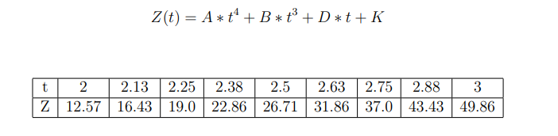
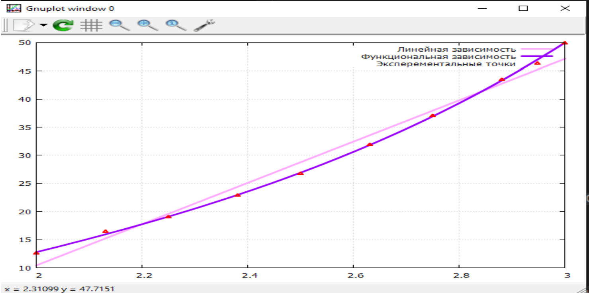

#  Лабораторная работа по теме «Обработка результатов эксперимента. Метод наименьших квадратов.»
## Постановка задачи: В результате эксперимента была определена некоторая табличная зависимость. C помощью метода наименьших квадратов определить линию регрессии, рассчитать коэффициент корреляции, подобрать функциональную зависимость заданного вида, вычислить коэффициент регрессии. Построить график экспериментальной зависимости, линию регрессии и график подобранной зависимости. Определить суммарную квадратичную ошибку и среднюю ошибку для линии регрессии и подобранной функциональной зависимости. Написать программу на языке С(С++) для решения задачи. При необходимости напишите функцию решения системы линейных алгебраических уравнений.
## 
## Результат работы программы:
## 
## Графики экспериментальной зависимости, линии регрессии и подобранной зависимости:
## 
